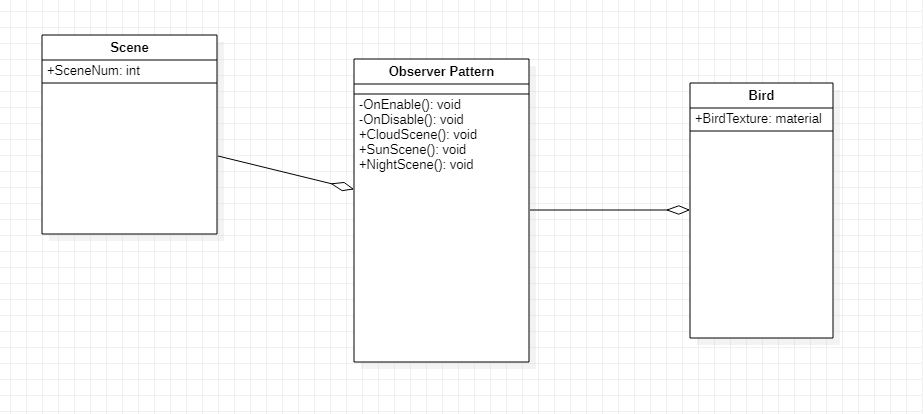

# INFR 3310U - Game Engine Design And Implementation Final Exam

### Prime Number -Artist (Option 2) Alvin Ng 100754129

### Demo Video
Youtube link: [https://youtu.be/cW8o-VWiNHc](https://youtu.be/cW8o-VWiNHc "Youtube")

### UML Diagram

### Third-Party acknowledgement

No Third-Part art or sound assets were used

Code was used based on in class tutorials and websites
Object Pooling: [https://learn.unity.com/tutorial/introduction-to-object-pooling]

